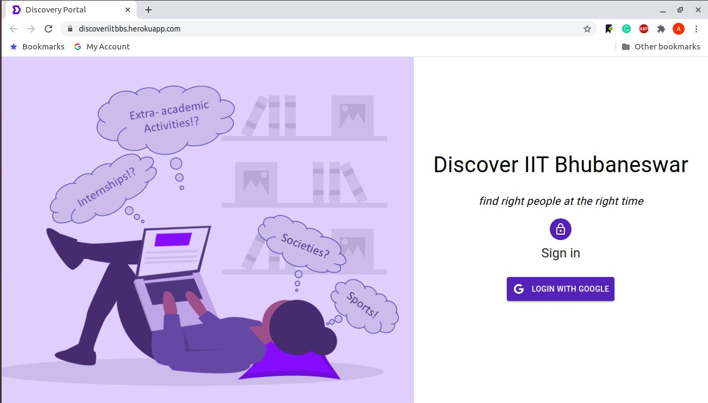
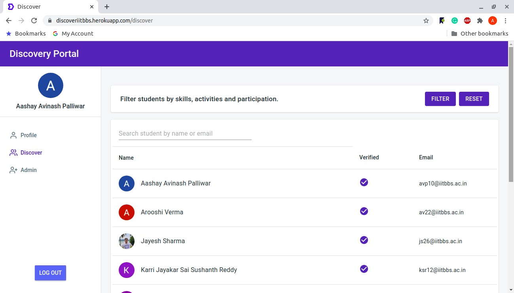
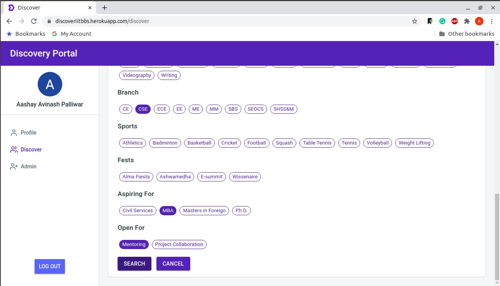

# DISCOVER.NEURO

Getting the right people to collaborate at the right time is often tough, more so when the semester goes on virtually. This is our attempt to provide a directory of our students which supports search based on skills, positions of responsibilities, student activities and, of course, branch and year.

The portal supports workflow for verified profiles, robust reporting for spam-prevention, sign-up control and has a pretty UI (thanks to the ingenuity of our developers).

 

**Kudos to our developers who delivered this project**
 
[Sai Krishna Jupally](https://www.linkedin.com/in/sai-krishna-jupally-b7050177/)
 
[P. Kartikeya](https://www.linkedin.com/in/p-kartikeya-29a0a319b/)

**[Login Page](http://discover.iitbbs.live)** 
 
 

 

**[Home Page](http://discover.iitbbs.live)** 
 
 

 

**[Search by tags](http://discover.iitbbs.live)** 
 
 

 

---

<h3 align="center">Feel free to contact me for further discussion!</h3>

  <a href="https://aashaypalliwar.github.io/" target="_blank">Webpage</a> •
  <a href="https://bbs-underscored.github.io/" target="_blank">Blog</a> •
  <a href="https://www.linkedin.com/in/aashay-palliwar/" target="_blank">LinkedIn</a>

